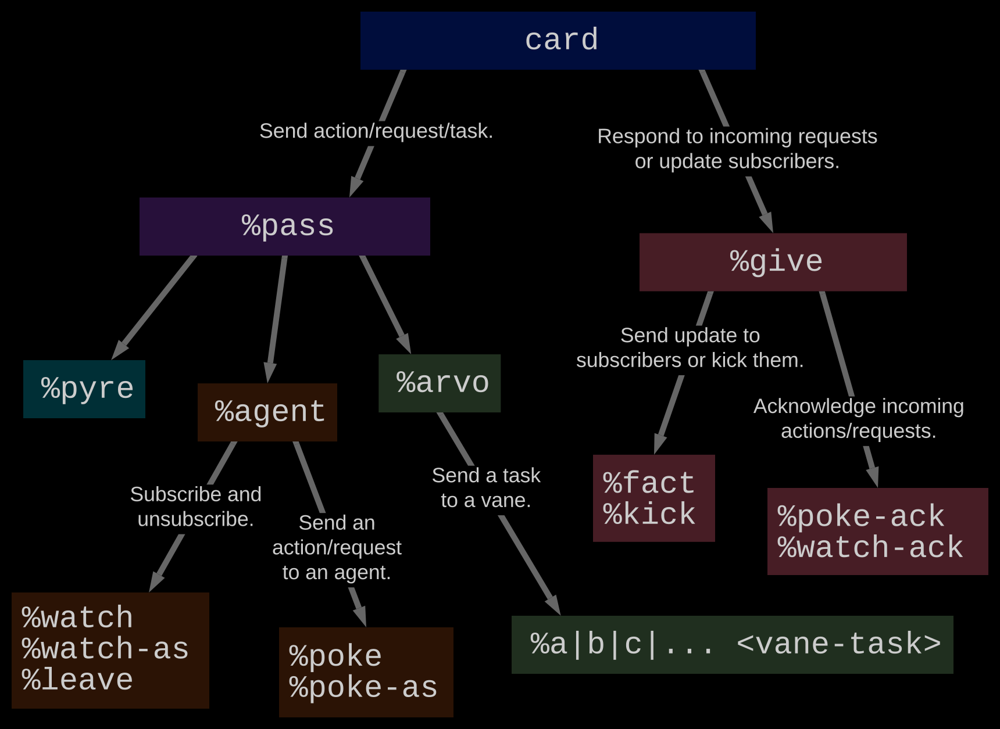

## App School  (Self-Taught) Notes:

At the time of writing, The 23' Zorp Hackathon will begin 1 week after HSL ends. I don't feel this is sufficent time to learn apps and produce an application that is complex enough to present at Assembly Lisbon 23'. 

To better prepare for the hackathon, I am teaching myself App School. These notes are pulled from the urbit.org Developer's portal, Neal Davis's Hoon School Notes and Blog, as well as other sources. Lets begin.

## Glossary:

- Arvo: Urbits OS.
- Noun: A noun is an atom (a single value +ve integer), or a cell of two nouns.
- Core: A special cell that pares operations to data.
    - Arms: The comptation portion of a core.
    - Legs: THe data portion of a core.
- Door: A Core with a sample (??)
- Vanes: These are core Arvo (OS) modules that perform system level operations. Some important vanes:
    - Ames: P2P networking.
    - Behn: Timer Vane
    - Eyre: HTTP Vane
    - Gall: Application Vane
- Scry: Read only REQ to the namespace of a local vane or agent. 
- cage: a cell of [mark  vase]
    - mark: a @tas term used to mark data.
    - vase: data payload that is packaged in some way (?).
##  Lesson 0: Arvo and Creating Simple Agents:

- Def: App: the entire desk you are distributing.
- Def: Agent: A single process running on a particular Desk.
- Analogy of an Agent: It is a state-machine. It must respond to all possible outputs, and act accordingly to transition to another state.
    - It is a piece of software that maintains and distributes a stateful structure.
    - It has an interface that lets other entities interact with it.
    - It transitions based on a predefined function and input, and must guarentee that the next state is valid.

- use faslus (/+) to import libraries from /lib on Mars.

- You need to really understand cores and arms to understand the code that is presented.

### The Agent Core:

- A Gall agent is a door with 10 arms. Each arm being responsible for handling specific events.
    - Analogy: A React/JS framework that handles user interaction events.

- Basic Summaries of Arms:

1) State Management: For initing and upgrading an agent.
    - on-init, on-save, on-load...

2) Request Handlers:  These handle internet requests.
    - on-poke:  Handles one-off requests.
    - on-watch: Handles subscriptions
    - on-leave: handles un-subscribe actions.

3) Response Handlers: These handle agent responses (info sent back), that our agent receives from making its own requests.
    - on-agent: Req agknow. and subscription updates from other agents.
    - on-arvo: Handles vane responses

4) Skry Handler:
    - on-peek: local read-only requests (Like IPC?).

5) Failure Handler: 
    - on-fail: RT error crashing, handles crash reports from Gall.

- Wrapper for a request: a **bowl**.
    - Same as your REQ/RES object for a JS server framework...

- Each interaction is predecated on Arvo's transition function:  (event, oldState) $\rightarrow$ (effects, newState).
- Most of the Gall arms produce a cell that contains two types of data:
    - Cards: A list of effects.
    - Modified Core, usually with the same battery but a modified payload (read: subject for the battery).

## Lesson 1: Arvo Services:

- Arvo is the OS and Kernel of Hoon, which compiles to the Turing Complete Nock low-level language.
- Arvo is executed in the RT environment with the Virtual Machine called Vere.
- Arvo is segmented into 9 core modules (called Vanes). See above for some of them.

- The core operation of Arvo (for any system like call), is to execute the Transition Function:

$$TF(oldState,Events) \rightarrow  (effects, newState) $$

- Arvo routes events to different vanes, and coordinates things.
- Arvos current state is the end result of a set of events that have operated on it, via the transition function and agent interactions.
- Formal State: A log of events, in a linked list of nouns. It can be recomputed from the beginning at any time.

- Events have two key properties that give us guarentees for state transitions:

1) Atomicity: The event is written to the event log, and only then the effects of the event are applied.

2) Consistency:  The database is in a consistent state before an effect, and after an effect. All transitions of state are result in a valid database.

- In general, you will design apps taht mainlu use Gall, and also use Eyre, Behn and sometimes Clay. Other vanes are not often used (at least, at the beginner level).

### Ames:

- this vane uses UDP to transmit messages between ships.
    - unlike TCP, urbit nodes don't care if some packets are lost. We don't need a handshake, or agknowlegement for every package.
- Urbit has acks (+ve) and nacks (-ve) responses. If a packet gets to its destination, we don't do anything.
- If the packet is recieved, but in error or not recognized, the ship may send a nack with an error payload (optionally).
- messages may be of arbitrary length, and are broken into Maximum Transmissible Units.
- Postel's Law:  "Be conservative in what you send, and liberal in what you accept".
- Ames Arms:
    - call:  handle request stack
    - take: handle response sign
    - stay extract state before reload
    - load  load in old state after reload
    - scry: deref namespace.

### Behn:
- timer/wakeup call system.

### Clay:
- our vane that manages a globally-addressable file system. 
- attaches ID tags to data, these are called "marks". They act like MIME types.
- Practically, a desk is a discrete collection of files on Clay. Analogy: A desk is just a git branch.

### Dill:

- simply drives our dojo terminal.

### Eyre:

- our HTTP server. Mainly uses PUT, GET and POST requests.


### Understanding Cards Better:

- read this before hitting Lesson 2!
- cards are a typed structure that store information. This is known as `card:agent:gall`. The data inside the three subtypes listed are known as *(wind  note  gift)*.  

#### Winds and Pass Cards:

- Gall will only accept %pass and %give types of winds.
- %pass:
    - **passes are unsolicited!**
    - this type of card is used to send a one off request to another agent or vane.
    - your agent initiates the %pass request.
    - Structure:  [%pass  wire  note]
    - **wire:** This is a path, which the agent being queried will send a response back to. Your agent will check what is written at this wire, to see the response (if applicable).
    - **note:** Contains information for the request.
        - Structure  [%agent  %arvo  %pyre]
            - %agent: holds the ship and agent name.
            - %arvo: information request for a particular vane at site.
            - %pyre: used for error info - not needed atm.

#### Tasks:

- There are two catagories of tasks:

1) Subscriptions:

- Both types below are kinds of %pass-es...
- %watch: a type of subscription request. You specify a path, and the distant agent will send updates to this path (much like a wire). 
- %leave: allows you to unsubscribe.

Example: A %pass subscription, is structured as follows:

```
[%pass  /some/wire/...  %agent  [~aship  %some-agent]  %watch  /another/path/...]
```

- card portion: `%pass  /some/wire/...`
- note portion: `%agent  [~aship  %some-agent]`
- task portion: `%watch  /another/path/...`

2) Pokes:

- just a one off message with no expected response from the target.
- the data portion contains a cage which is just a [%mark and vase].
- Example card structure:

```
[%pass  /some/wire/...  %agent  [~aship  %some-agent]  %poke %mark !>(vase data)]

```

### Give Cards:

- gives are solicited. They respond to a request made by another agent or vane. 
- Structure:  [%give  %gift-term  tang]

- There are two main types of give cards:

1) Acknowledgements:

- %watch-ack: a response to a %watch or %watch-as pass request.
- %poke-ack: a response to a %poke or %poke-as request.
- if tang (error packet is null), its a +ve ack. If populated, its a nack.
- Caveat: Gall sends an ack if your agent does not crash when processing a request. So you don't need to send a %watch-ack or %poke-ack.
- Example Request:

```
[%give  %watch-ack  [leaf+"foo"  leaf+"bar"]]
```

2) Subscriptions:

- %fact and %kick must be sent out to existing subscribers - those have have placed a %watch in the past.
- There are also %facts, which are updates sent to subscribers.
- Example Response:

```
[%give  %kick  ~[/some/path  /another] ~some-ship]
```

- Summary Image of Card Types (see below):




## Lesson 2: More on Agents:

- upper-level (vane) components communicate with moves, while Gall agents communciate with **cards**.
- Recall from last time, two of our unsolicited cards are [%pass wire note] and [%give gift] types. 
    - *notes* are either of type %agent or %arvo. The former is for Gall agents to talk to other gall agents.
    - if we give a gift, this is to poke, ack or kick other agents...


### Pokes and Peeks:

- Pokes are messages to agents (not vanes).
- A peak is a kind of skry: it queries other name spaces for pieces of state data.
-

