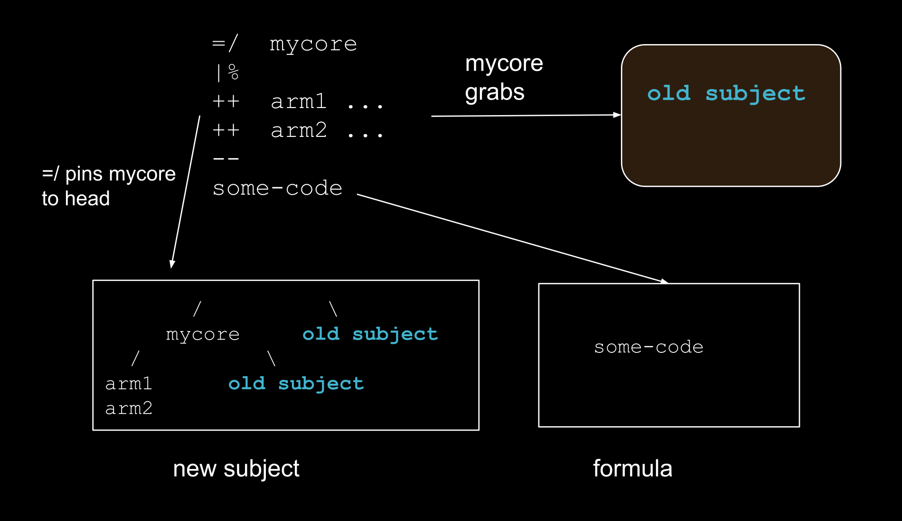
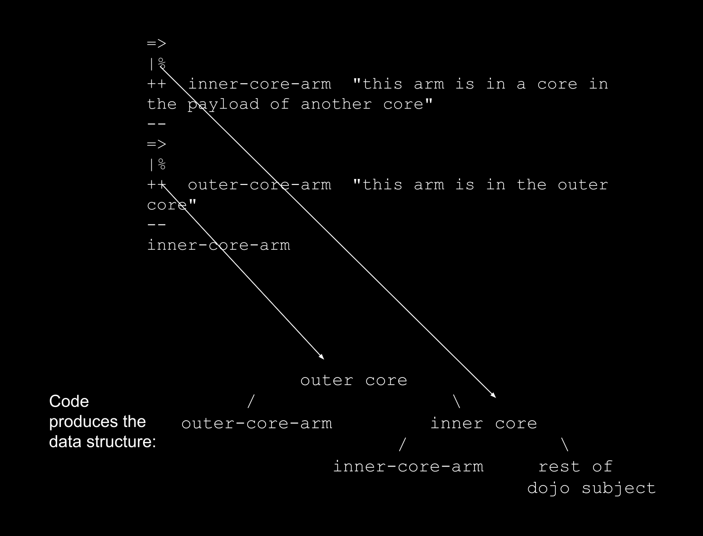

## Week 0: Intro to Computing and Functional Programming:

#### Formal System:
- Axioms: starting points - facts that we assume to be true.
- Inference Rules: Operations that can be repeatedly applied to axioms to derive new truths.
- Anything that can be reached or derived from IRs...(Axioms).

- Why bother with formal systems? If we make a formal system for our computers...
    - This formal system has a theorem with property X <=> This computer can reach a state with X property.
    - All theorems of this system has Z property <=> All states of this computer have Z property.
    - You can make corresponsences between your formal system and the world it is modelling.
        - If the formal system has a property / theorem that is true <=> It is true in the world.

- Example: Simple System:
    Axiom: MI.
    IRs: 
        - xI -> xIU: add a U if string ends in I
        - Mx -> Mxx : double a string
        - xIIIy -> xUy:replace substring III with U

    A Theorem: 
        - MIU is a theorem, because we take the axiom and apply the first IR.
        - MIIII is a theorem, use axiom and apply rule 3 and then rule 1.
        - etc..

- Example: Addition:
    Axioms: nwhere n is a number, or:
        - add(a,b), sub(a,b), mul, div...
        - note that operations between two numbers are axioms here, and the definition recurses to basic number.
    IRs:
        - If a,b are numbers:
            - add(a,b) tree => a+b
            - ...div(a,b) tree => a/b
            - etc...
    - We can also use variables, and substitute other trees into variables....

The system above shows us the mechanics of functional programming. In imperative programming, we tell the computer how to do things (recipes and routines). In functional programming, all operations are functions that take inputs to outputs, and they are piped / composed together. Ideally, there is no state and it is carried though the input/outputs of each function.

In addition to composure and piping, we can also do 


## Week 1: 

**Urbit ID Basic Stats:**
- Planets: 2^32
- Stars: 2^16
- Galaxies: 2^8

- For the tutorials this week, we will be using Fakeships to practise using Urbit's underlying datastructures.

- The urbit binary, when run, has its own mini file system much like Linux. This system is collectively known as "Mars", and the Linux file system it is contained in is called "Earth".
- Urbit File System Root Folders:
    - /app:
    - desk/bill:
    - gen/: 
    - lib/:
    - mar/:
    - sur/:
    - sys/:
    - ted/:

- Analogy: We develop our scripts and code on Earth, and send them to run on Mars (in Urbit).
- Urbit organizes collections of code as "desks". 
- To see a desk from "Earth" It must be mounted in the dojo: `|mount %base`
- To update a desk (when we alter code on Earth), run `|commit %<deskname>`

#### Running Code in Dojo:
- we can write code inline.
- Note: Only syntactically correct code can be entered. The console cursor will freeze if you make a mistake.
- all nouns/entities for a line of code must be separated by **double-spaces**.
- Numbers > 999 must be separated by a dot, to delimit thousand units. So 1000 = "1.000".

#### Binary Trees:

- At the intermediate level of interpretation, your ship is a binary tree of integers...this is where your ships memory (state) resides.
- Urbit stores all ship information in a massive binary tree, and has predefined rules to transform/update the tree.


- Formal (Recursive Def) of Noun: A noun is an atom (a single value +ve integer), or a cell of two nouns.
- Nouns: Are atoms (basic pieces of data), or cells that can be nested arbitrarily. Examples:
    - Atoms (1,2,3...)
    - Cell: [_,_]
    - Cells of Cells.

- Binary Tree and Cells+atoms are isomorphic, you can build the former with the latter.
    - Our cells form the nodes and leaves, and our atoms fill the nodes+leaves with data.
- Binary Tree numbering is just Binary Heap Numbering from CS. So urbit numbers our binary trees as:

```
            1
        2       3
    4   5       6   7
8   9 ...

```
- If we have incomplete binary trees, missing nodes still retain their heap ordering (we don't skip counts).
- Visual Isomorphism for going between binary trees, and cell lists:
```
    (Root)           
   /     \        ===         [ <>  <> ]
  <>     <>
```
- Note:
    - **Our indexing starts at 1, not 0 (!!!)**
    - We never display a slot for the root node, only the two sub-trees.
    - Any non-atomic node is represented by [] - only leaves are represented as data in our cell notation.
    - **A Visual Checksum:** Count the number of closing brackets "]]]]]...." to check that you got the tree depth correct.

#### Tuples:

- Binary trees, when given a specific structure, are interpreted as tuples by Dojo. This is done by having a long branched tree, where one cell has an atom, and the other a nested cell.

```
[1 [2 [3 4]]]

/ \ 
1   /\
    2 \
      /  \
      3   4
```


#### Lark Notation:

- Urbit uses a relative notation to "traverse" a tree from root, to a specified node further down the tree.
- **Rules:**
    - Characters used: {-, +, <, >, .}
    - Format:
        - Begin with -,+ to indicate L/R, respectively.
        - Then switch to < > to indicate L/R, respectively.
        - Continue to alternate as you go down the levels...
        - Dot "." means Root.
            - we access the root of the tree with ".tree"

- Example 1: -.tree: the left subtree of "tree", from the root.
- Example 2: ->+.tree: left subtree, right sub-sub-tree, and right leaf of "tree".

- Note that our directions are read L -> R, and the structure's root node (.tree) is on the right.


#### Faces:

- Faces: We can name specific nodes, to avoid long strings of Lark notation.
- what happens if we use the same face variable multiple times in the same tree? Urbit will DFS to find the first one. We need to keep track of which one we want. Use the caret "^" character to specify which one you want.
- Urbits DFS: Keep going down the Left Branch until you find the "First" match.
- Example of Usage:
```
> =a [b=1 [b=2 [b=3 b=4]]]

//Go left, first result
> b.a
1

//Go left, then go right and left again (...repeat) until a third match found
> ^^b.a
3

```


#### Numeric Addressing of Trees:

- Use the plus operator and the index, follow by the tree reference. For example `+5.tree`, `+14.tree`...etc


### Nock:

The Nock system underlies how urbit mutates the state of its binary trees using clearly specified rules.

- For now, lets give a quasi-(more specific)-definition  of a function using our Binary Tree Structures: A binary tree with "variables", that is waiting to be computed **is a function**. When we fill in the values, we can reduce the tree down to an atomic output, or another binary tree.

- Instead of data-function, lets use subject-formula.
    - subject: the tree we wish to operate on.
    - formula: Our series of Nock codes (with parameter inputs). 
- All Nock code is a cell (our 2ple structure from above), in which a subject is placed in the first slot, and formula placed in the second slot.
- Nock has 12 rules for reducing and manipulating binary trees - these are given enumerations (0-11) instead of names. One says "apply Nock 11", not "rebalance sub-tree" when referencing the operations.
- CS Fact: Nock 0-5 rules are all that is needed for Turing Completeness. All other rules can be derived from these first five rules.

#### Nock Operators:

- ?[x]: reduce to 0 if x is a cell, 1 if an atom
- +[x]: reduce to the atom x plus 1
- =[x y]: Reduce to 0 if x and y are the same noun, 1 otherwise. 

#### Nock Formulas (Or Instructions) [NockRules]: 
Subject (Input) ===> Nock Formula.
Example: [[5 6] [7 8]]  [0 2]

1) [0 b]: Reduce to noun at address b
2) [1 b]: Reduce to a constant noun b
3) [2 b c]: Treat b and c as formulas, resolve each against the subject, then compute nock again with the product of b as subject,
and c as a formula (?)
4) [3 b]: Compute formula b on a subject. Return 0 if its a cell, and 1 if an atom.
5) [4 b]: Compute the formula b on the subject, and increment the result by 1 (if an atom)


### Runes:

- A rune is essentially a funciton call, that is referenced by a two symbol name.
    - This allows for very dense code.
    - Each rune consists of a prefix and suffix (such as col-hep, or tis-lis).
- Runes evaluate from the most nested, and then outwards (order of operations). 
- So For example:
    1) `:- :- 1 2 3`: we do (:- 1 2) first, and then (:- [1 2] 3) next.
    2) :- 1 :- 2 3: we do (:- 2 3) first, and then :- 1 [2 3]
- A table of all possible rune symbols is below. 

### Nocking with Hoon:

- Tislet Rune (=+): Takes two inputs. Sets the first as the "head" of the subject, while the second is a hoon expression


## Week 2:

- Running Nock Code: Use .* Rune. Format: `.* [subject] [formula]`
- True and false types:
    - %.n = False = 1 (@ud)
    - %.y = True = 0 (@ud)

- Hoon is technically built on top of Nock. 
    - C Programming Analogy: Hoon is C, Nock is Assembly code.

- Limbs: Are parts of the Binary Tree.
- Wings: Are combinations of limbs of the Binary Tree.

### Hoon Code Syntax:

### Tall Code: 

This is the underlying (basic) form of code. It can be written two ways. With double+ spaces, or line breaks. For example:

```
:-  1  :-  2  3

OR

:-  
1
:- 
2
3
```

#### Wide Code: 

- Similarly, this is written with Parens, and uses single spaces:

```
:-(p q)
```

- Note, that much like composed functions, chained wide code nests inside of itself. For example:

```
=>(['dog' ['cat' ['snake' 'mouse']]] =.(-.+7 'platypus' =+('echidna' .)))
```

- For gates, wide code is written as follows:

```
%-  sub  [4 1]

(sub [4 1])

```

#### Sugar Code:

Many runes have there own form of sugar syntax. Note that it can be a bit ideosyncratic (just check the [rune reference](https://developers.urbit.org/reference/hoon/rune))

- Example: The coltar (:*) rune, can form a tuple from any number of arguments. Equivalent sugar syntax is seen below:

```
:*  1  2  3  4  5  6 ==

[1 2 3 4 5 6]

```

- Note that Wide and Sugar code can be substituted into Tall code, but Tall code cannot be substituted into the other two.
    - guess: this is because tall code is not delimited, but Wide and Sugar are (parsing errors).

### More Cen (%) Runes, for calling Gates:

- cenhep (%- ): Calls a gate with one argument. 
    - Usage: `%-  add  :-  4  1`  or `%-(add :-(4 1))` or `(add 4 1)`
- cenlus (%+): Calls a gate with two arguments.
    - Usage: `%-  add  4  1`  or `%-(add 4 1)` or `(add 4 1)`


### More on Hoon and Nock:

- for unbounded lists of children, use tistis (==) when using Tall Form.

- Running Nock Code: Use the dot-tar .* rune. Syntax: `.* <nock subjet> <nock formula>` 

- Hoon and Nock are interrelated. Consider the tis-gar rune: this **sets the subject** and then runs expressions on it.
    - ` =>  <subject> <code to evaluate against subject>`.
    - Note that this replaces the global binary tree with whatever subject you set. So you can't run gates with this. For example:
    `=>  [a=1 b=2]  =.  a  100  %-  add  [a 1]` will fail! Because *add* is in the global urbit tree.
    - To solve this limitation, use the tis-lus (=+) rune from HL1, and reference accordingly.
- Also consider the dot-tis rune: `.= <expr 1>  <expr 2>` 
    - This rune runs both expressions (or formulas), and tests for equality. Doesn't have to be a nock expression. For example:
    ```
        .= 3 .+ 2

        > %.y
    ```
- Together, these two runes (chained), do the same thing as the .* rune.

- Two Equivalent Statements:
```
.*  [50 [8 9]]  [5 [[0 2] [0 6]]]

=>  [50 [8 9]]  .=  +2  +6

```
- tis-gar (=>) and tis-gal (=<): Both of these compose two juxtaposed expressions. Tis-gal just does it from back to front, and will produce the same result (if the inputs are reversed).

- As we learned in HL1, tislus (=+) pins something to the head of a subject (+2 position), and moves an older subject to +3.

- tis-dot (.=) Rune: Allows us to select something from a subject, modify it, and then run code against the new subject.
    - ` =. <something in subject> <new val> <code expr>`
    - Example: `=>  ['dog' ['cat' ['snake' 'mouse']]]  =.  -.+7  'platypus'  .`

- Setting Faces (underlying code): Use kettis (^=). For example:

```
=<  a  :+  ^=  a  1  ^=  b  2  ^=  c  3

Will generate [a=1 b=2 c=3] and return the value of a
```


- Hoon and Nock have a close relationship. Hoon is largely built over Nock, and operates under a Subject Oriented Programming Model

- In Subject Oriented Programming, code is organized around entities that have relevance in the problem domain (to be solved). Compare this to OOP, which [krayonnz]:
    - Use object containers, with properties and methods to act/store relevent problem data. Objects work with one another by being placed into hiearchy trees.
    - With SOP, abstractions are typically higher level. There are also "viewpoints" or "perspectives", depending on the agent or user. [SOPwiki]
    - with SOP, we abstract different "Subjects" and focus on them to operate in the problem domain/come to a solution.

- In Hoon, all code is evaluated against a data context called "the subject", the subject is a binary tree (either the entire urbit running instance, or a wing/limb of it).

### Casting with the Ket Family:

- Every single data entity in Hoon can be represented as a positive integer (with the **empty/atom aura** '@'). More specialized types exist beyond this.
- We use the ket family (^) to work with auras in Hoon.

- kethep (^-): `^_ <type> <child>` Cast the child in the 2nd slot as the type listed in the first slot.
    - If it cannot be cast, urbit crashes.
    - this rune is used for basic type check+exception throwing, effectively.

- Why do some types not convert over? You can only convert from @X to @Y if Y **nests** under X (**analogy:** is a subclass).

    - *Easy way to infer nesting:* if the aura of type we are casting **to** has the letters of the aura we are casting **from** as a substring, we can guarentee a proper cast.
    - Example: @ -> @t -> @ta   -> @tas, because previous auras are substrings of later auras.
    - Example2: @t /-> @, however. This will fail.

- if you try to cast improperly, Hoon will throw a nest-fail error.

- So is it possible to convert types on one side of the tree to another? Yes, using the empty aura as an intermediate. - 

- Recall that ` @ux 'hello' ` was able to cast to a hex integer last lecture. To do so, we use the following syntactic sugar which converts to the following tall code:

```
`@ux`'hello'
^-  @ux  ^-  @  'hello'
```

- ketlus (^+): `^+ <child1> <child2>` Infer the type of child 1, and cast child2 as the same type.

- kettar (^*): Takes a type as a child, and returns the "default value". Usage and sugar syntax below:

```
^*  @p
*@p
```

#### Rune Familes:

- bars (|): Produce cores.
- bucs ($): Produce structures - custom types.
- cens (%): allow for function calls in Hoon.
- cols (:): help us produce cells.
- dots (.): allow us to perform low level Nock Operations.
- fases (/): allow for imports into Hoon.
- kets (^): allow us to adjust types without violating type contraints.
- mics (;): Makes, misc macros (?)
- sigs (~): work with Nock 11 to pass non-semantic info to the interpreter (?)
- tises (=): modify subjects.
- wuts (?): used for program control and branching.
- zaps (!): misc expressions (wildcard stuff).
- terms (==): Used to terminate unbounded expressions (an interpreter hint).


#### Limbs and Wings:

- a limb is a name for a singular address in the subject.
- a wing is a search path, that consists of one or more limbs strung togehter.


## Week 3: Molds and Program Control:

- Molds are more complex structures (like Struct data types).
    - Instead of atomistic data types (@p, @ud...), we can make composite structures of atomic types.

- kethep (^-): Last time, we learned this rune to convert a value to a given type. For example: `^-  @ud  %-  add  [1 2]`. This expects a type in the first slot. Note: Hoon interpreter enters structure mode when the first arg is hit.

### Structure vs Value Mode:


- Hoon parser has a "structure mode" and "value mode": "structure mode" interprets a type specification, instead of computing a value expression.

- tis-fas (=/): Combines a named noun with subject, with possible type annotation. Usage: `=/ name=@type  <val>  <selector>`

- We can set type information to our face pinning operations. For example: `=/  word=@t  'hello'  word`.
    - This is actually syntactic sugar, for the buc-tis rune:  `word=@t` ==> `$=  word  @t`
    - =/ does not reduce to `$=`, its inner expression does (!)

- buc-tis (`$=`): Pin a face to a type, (uses structure mode). Usage:  `$=  <facename>  <@type>`
    - Compare kettis (^=): **which is done in value mode.**
    - (**)

- Comparing ket-tis (value mode) vs tisfas (structure mode):
    - [word='hello'  num=2] desugars to `^=  word hello`.
    - =/  word=@t  'hello'  word desugars to `$=  word  @t`
    - **Distinction:**, kets deal with values, and bucs deal with types.

### Building and Using Simple Molds: Banking App.

- buctis (`$=`): Recall this pins a face to a type
- buccol (`$:`): Takes an indef.number of children, and each child is a specification of a type. This creates a composite type structure which is represented as a cell. Usage:

```
=bankaccount  $:  $=  ship  @p  $=  money  @rs  == 
```

Note that we can use this mould, to create a cell with values. The following are all equivalent:

```
(1) `bankaccount`[~zod .123456.78]


(2) ^-  bankaccount  [~zod .123456.78]


(3) ^-  $:  $=  ship  @p  $=  money  @rs  ==  [~zod .123456.78]
```

- Note that (1) desugars to (2), and (3) is us just slapping in our mould definition in-line. That also works.
- How does the Hoon interpreter build our bankaccount cell?
    - It checks the first position of the mold, and sees an @p (ship). It then checks the first position of the value (~zod). @p nests in @p, so it populates the first value of the cell. It does a similar matching for the second type.

### Casting v.s Molding:

- moulds can be called as gates. In fact, moulds are a subset of gates (!!).
- Conundrum: When we call:  `^- bankaccount ['hello'  .12345]` it fails, because our first value (@t) does not nest with an @p ship name. Yet we can call: `%-  bankaccount ['hello'  .12345]` and it works. Why?
    - When molds are called as gates, input cells are treated as raw nouns (@'s) with empty auras, so our atoms can be fit to any type possible. If we do this however, our information (usually) gets garbled.
- Note the Differences Between Casting and Molding:
    - **Casting:**
        - Usage: `^-  <type>  <hoon value expr>`
        - Checks the result of <hoon value expr> element-wise, with the <type> mold, to see if the types nest.
        - Will fail with a *nest-fail* error if nesting is wrong
        - Occurs at **compile time**
        - Used to check for type errors in blocks of code.
    - **Molding**
        - Usage: `%-  <type>  <hoon value expr>`
        - Coerces the results of the expression to the types of mymold (all values are empty auras).
        - Occurs at **Run Time**. Never throws errors.
        - May cause RT errors, or other unintended side-effects, or garble our information (!!)


### Type Unions:
- Type Unions made with bucwut ($?). Usage `$? <spec 1>  <spec 2>  <spec 3> ... ==  `
- Note, if we try to fence (^-) a value with a type union, it will always pass, and be converted to the last listed type.
- Example Usage:

```
=newtype  $?  @t  @rs  @da  ==

If you run:

^-  newtype   .123.45

It will pass and cast as a date (!!)

```
- In Practice: Type unions are used with **terms**.
    - A term is a constant with aura @tas, and is considered a unique type in itself (it is its only instance).
    - Example Definition:  `=reptile  $?  %snake  %lizard  %croc`. Only these three will pass when called, and be cast as one of the terms.
    - Example Casting:  `^- reptile  %snake`
    - Example Molding: `%-  reptile 110.442.424.461.676`. This becomes a %lizard, as the underlying raw number represents an @tas of value %lizard...
-

### Program Control: Branching:

- wutcol (?:). This is our IF THEN ELSE statement.  Usage: `?: <condition>  <True expr>  <False expr>`
- for program control, the wut (?) family of runes is used.
- wutsig (?~): Branches on null. Specifically, if the branching expression evals to null (~) it will take the first branch. If not, it takes the second.
    - Usage:  `?~  <expr>  <branch1>  <branch2>`
- wuthep (?-): Acts as a switch statement. Takes an argument,and tries to match it to one of the cases:
    - Tall Form:
    ```
    ?-  <argument>
        <noun1>  <expr1>
        <noun2>  <expr2>
        <noun3>  <expr3>
        ...
        ==
    ```
- wutlus (?+): Another kind of switch statement, with a 'default' or 'else' case at the top. For only specifying cases for some values.
    - Tall Form:
    ```
    ?+  <argument>
        <default expr1>
        <noun1>  <expr1>
        <noun2>  <expr2>
        ...
        ==
    ```
- mint-vain error: The compiler is telling you that you have branches that will never be taken (extraneous)

### Logical Operators:

- Hoon has the usual operators (Not, And, Or..). These are actual runes. Usage below:
    - And Operator (?&):
        - Tall Form:  `?& <pred1> <pred2> <pred3> ... ==`
        - Sugar Form:  `&(<pred1> <pred2> <pred3>)`
    - For OR, syntax is the same as AND, but with pipe symbol (|)
    - Not Operator (?|):
        - Tall Form:  `?! <predicate>`
        - Sugar Form: `!<predicate>`

### Comparison Operators:

- These are two input gates. The usual numeric operators are included (gt, lt, lte...).
- General format for usage, below:
    - Tall Form:  `%+  gth  x  y`
    - Sugar Form:  `(gth x y)`
- Remember: The full urbit tree must be available in local subject, your you will get a mint-vane error (gate not found).

- Recall the dottis rune, which compares two nouns:  `.=  <expr1>  <expr2> `
    - Sugar Syntax:  `=(x y)`
    - Will ignore type information, and just test for equality between nouns.


## Week 4:

### Final Discussions on Style and Syntax Forms:

- You select which form is appropriate given context. In general, we want good readability for ourselves, and other programmers.
- Recall: You cannot use tall form in Wide or Sugar. You can use Wide or Sugar in each other, or in Tall form.
- Runes Documentation will give hints to what preferred developer style is.
    - Eventhough Tall form can be written on one line....for long expressions, this is rarely done.


### On Lists:  

- a list in hoon is a structure where each cell has the same datatype, but is not of a fixed length.
- you will need data types that don't know in advance how many slots they need. **This is what lists are for.**
- A list is a null-terminated tuple. If you make a list that is terminated by sig, it *can* be a list. You must cast it to a list to make Hoon understand

- all lists are a form of binary tree. Specifically, a rightward branching binary tree that is null-terminated. Really, they are a form of tuple that are terminated with a sig. Structurally, it looks like:

```
/  \
1   /  \
    2   /   \
        3    /   \
            4    ~

[ 1 [2 [3[4 ~]]]]
```
- Can just manually enter a list with sugar syntax:  `~[1 2 3 4]` or `[1 2 3 4 ~]`
- The empty list $\epsilon$ is just a sig (~).
    - Exception: Only sig on its own is an empty list. Cells of sigs are **not** lists.
- `list` is a mold maker gate.
- Finally, Hoon will not assume a null terminated tuple is a list. You must use the list gate, or cast to a list explicitly.

- Note the following line of code:  `^-  %-  list  @ud  [1 2 3 4 5 ~]`
    - list is a **mold-maker gate** - it will take in an input, and output a typed list structure.
    - so `list  @ud` on its own is like a partial function, that will accept an input [1 2 3 ...] and output a list structure.

- Prepending to a List: Is easier than adding to the tail (O(1) vs O(n) time). Example Code (Sugar):
```
=/  mylist=(list @ud)  [2 3 4 ~]
  ^-  (list @ud)  :-  1  mylist
```
- Note: THe (list @ud) type coersion (line 2) is necessary, else we will get a cell with a 1 in one slot, and mylist. This will be list shaped, but not interpreted as a list!

- a *lest* is a list that is non-null.
    - Wordplay: Lest means "to intend to prevent something, or avoid the risk of". Lest we forget...
    - `lest`, like `list`, is a mold-maker gate as well. You can cast any non-empty list as a lest. Lest will also pin faces i and t to the head and tail of the inputted list. Example Code:
    - Note: Running *lest* on ~ will return an eror.

```
> ^-  %-  lest  @ud  [1 2 3 4 5 ~]
[i=1 t=~[2 3 4 5]]

```
- access head and tail, respectively:  `i.a , t.a`
    - You need a =/ rune so that these faces are locally stored, else you will get an error. For example:

```
=/  starlist  `(lest @p)`[~sonnet ~winter ~diglet ~ponnys ~]
t.starlist
```

### List Library Functions:
- Warning: Some functions require "proof" [P!] that a null termed tuple is a list, and others will just accept it without explicityly stating the type. It is never clear which function is which, so check the [documentation](https://developers.urbit.org/reference/hoon/stdlib/2b).

- How can we explicitly prove a null-terminated tuple is a list? 
    - You can always cast it in line:  `^-  list @ud  ~[1 2 3 4...]`
    - Use the `limo` gate. Limo doesn't need to know the inner type, so its a bit shorter.
        - Usage (Example): `%+  snag  1  (limo  ['dog' 'cat' ~])`
- Below is a selection of useful gates that work on lists:
    - **flop:** Take a list, and reverse it. Usage: ` %-  flop  [1 2 3 4 ~]`
    - **gulf:**  Return a range bounded between a and b: Both a and b are included in the range (closed) 
        - Usage:  `%+  gulf  a  b`
    - **lent** Return the lenght of a list. Usage:  `%-  lent  [1 2 3 ~]`
    - **sort**: Two arg gate that takes in an uncast list, and a comparison operator.
        - Usage `%+  sort  [1 5 3 8 2 ~]  gth` 
    - weld: concats two lists. No need for proof.  `weld  [1 2 ~]  [3 4 ~]`


### Map-Apply-Filter like gates:

1) turn (map): applies a gate to each element in a list, and outputs a list.
    - Example:
    ```
    > %+  turn  [1 2 3 4 ~]  dec
    ~[0 1 2 3]

    ```

2) roll (reduce) [P!]: Applies a gate to each argument, and accumulates the result. Outputs the accumulated result.
    - Example:  
    ```
    %+  roll (limo [1 1 1 1 ~]) add

    > 4
    ```
3) skim (filter)[P!]: Applies a truth statement to each element, and returns a list of elements that made the test statement true.
- Example:
```
> =/  is-even  |=(a=@ud =((mod a 2) 0))
  %+  skim  `(list @ud)`[1 2 3 4 5 6 7 8 9 10 ~]  is-even
[i=2 t=~[4 6 8 10]]

```

### Text:  Cords, Knots, Terms and Tapes:

- text can be represented as @t (cord), @ta (knot), @tas (term) and as a list (*tape* - which allows for string manipulations)
- all text is delimited with single quotes. We delimit with double quotes when we are using the *tape* data structure.
- what are tapes for? They are lists internally. They use 6x as much storage (!!). But they allow for character level text manipulation.
- We generally store data as cords, and when we work on them, convert them to tapes (transcription analogy...).

- Formatting/Restrictions of each Type:
    - Cord (@t): Any UTF-8 symbol
    - Tape (list @tD): Any UTF-8 symbol
    - Knot: Restricted, lowercase letters, numbers and "- ~ _ .". Used for system labels, mostly.
    - Term: Restricted, lc letters, numbers and "-" only.

#### Tapes:

- Recall tapes are actually lists. Each element in the list is a special @tD (an @t limited to 8 bits of representational data). 
- In hoon, `tape` means the same thing as the following mold:  `(list  @tD)`
    - Same thing:  `^-  tape ...` and `^-  (list  @tD) ...`
- **crip**: "Cord rip". Convert a tape into a cord.
- **trip**: "Tape Rip". Convert a cord into a tape.

- There are lots of gates that manipulate tapes, just as we have for cords.

- Tape Interpolation:
    - Use angle brackets to convert the result of a hoon expression into a tape.
    - Use curly brackets to interpolate in a tape string.
    - Combined Example:
        ```
            =/  x  5
            "Our sum is:  {<(add x 6)>}"
        ```

## Week 5:

### Introductory Ideas:

- cores are a programming pattern.
    - they store code as data.
    - specifically, this means uncomputed "arms", which are paths of computation that
    can be called from a core.
- a core is a cell that has [code-as-data  data-as-data]
    - a core is a cell of **[battery payload]**. If we choose to pin data to the head, our cells further specify to **[battery [sample context]]**.
        - The battery is the stored code itself. The payload is the data we wish to operate on.
    - In the end, its just another binary tree that we can nest in the Dojo binary tree.
        - Code goes on the left (+2), data on the right (+3).
- Arms: Named addresses where code is stored.
    - Arms consist of a face, and an expression to run.

- Syntax:
    - Cores made with Bars (|). We define a core with the barcen (|%) rune.
    - luslus ++ defines an arm of the core.
    - terminate definition with hephep --

### Know the Difference! Subject Modification:

Cores can be set as the subject, and act on subsets of the full Dojo subject. How these subject runes are used/differ is critically important to know:

1) Tisgar (=>):
    - Usage: `=>  <subject>  <expr>`
    - Sets the subject/payload (read: the focus or a subset of the dojo tree), and runs a hoon expression against it.
    - Use "." for the <expr> to just return the subject you set.

2) Tislus (=+): Sets the subject *like* tisgar, with one additional feature: Adds a name or type face to the head of the dojo tree.
    - Usage: `=+  <data or face>  <expr>`
    - again, it sets the payload, and runs a hoon expression against it.

3) Tisfas (=/): Sets the subject and places something at the head of the dojo tree (like tislus), and has a third slot to run more code.
    - Usage:  `+/  <face or type>  <data>  <expr>`
    - Will set data, a type or face setting, and place to tree. Will then run <expr> on the modified subject as well.
    - Core Idea: We can chain tisfas'es to make frames of scoped variables, if we wish.
    ```
    =/ var1  <data> 
        =/ var2 <data>
            =/ var3 <data>
                |%
                ++ ...
                ++ ...
                --
    ```

[***] Of particular importance are tisgar (=>) and tisfas (=/), as we will see. Tisgar has a dereferencing behaviour, where as tisfas is used to make blocks of scoped code...

### Defining and Using Cores:

- use the bar-cen (|%) rune to set a core.
    - Usage:  `|%  ++  face1  expr1  face2  expr2 ...  -- `

- if you type a core def right into the dojo console, it will return a data structure summary, that lists the folloiwng:
    - number of arms the core has.
    - its payload, including sample and context.

- When a core definition is encountered by dojo, the following things occur:

1) The entire dojo subject is grabbed for the payload, and put in the RHS of the core tree.
2) All of the arms are compiled to nock code, and placed in the LHS of the tree.

- **Note:** We never define cores all on their own (without => =/), as they have no subject and are not commited to the dojo tree.

- If you wish to set an empty payload with tis-runes, use **sig ~**
- Recall that with cores, code is stored as data. When arms are defined and placed in a data tree, they are rendered to **uncomputed nock code** and sit and wait to be called by their face.
    - compare this to running code expressions with tis-runes - these are **evaluated immediately**.

- We can see the unevaluated nock code, if we choose to reference the code tree with +-notation. For example:

```
> => 
  |%
  ++  increment-100  .+  100
  --
  +2

[4 1 100] 
```
- Code Pattern: Define an un-named core, pin a sample:
```
=> 
=+ var=value
|%
++  a  <expr>
++  b  <expr>
..
--
<arm expr> 
```

- Pattern: Define a named core, pin a sample:
```
=/  myvar  value
=/  corename
|%
++  a  <expr>
++  b  <expr>
..
--
<arm>.corename 
```
- **The scope of arms:**
    - arms can reference other arms, even if they reference arms that are defined **later** in the core definition.
        - you can't make ciruclar dependencies, however.
    - Arms have access to the cores payload.

- Structural Interpretation of a Named Core:
    - See the picture below!

    

### Core Composition, and Core-in-Arms:

- we can compose cores, by placing them into the data payloads of other cores. This is done using tisgar, in a chained fashion.

- Code Example:

```
=>
  |%
  ++  inner-core-arm  "this arm is in a core in the payload of another core"
  --
  =>
  |%
  ++  outer-core-arm  "this arm is in the outer core"
  --
  inner-core-arm

```
- **Parsing Code Above:** Note that for the first =>, the first core is child 1, and rest of expression child 2. For second =>, the second core is child 1, and the arm call is child 2. The code structurally looks like the following:

    

##### Cores in Arms:
- yet another way to compose is to put the definition of a core, in the expression slot of another arm.
- Remember: Arms are precompiled to Nock, and sit un-evaluated until called. This means...
    - That our core-in-arm definition is also sitting in nock notation, uncompiled.
    - (!!) So our inner core **is not defined** until we run the outer arm, and thus we cannot call the inner arm until we run the outer core arm (!!)

- A two-nested core-in arm example is below. You need to pull and run the outer cores to get to the inner-most arms, essentially.

```
=>
|%
++  outer-core  
    |%
    ++  inner-core
        |%
        ++  innermost-core  "inside!"
        --
    --
--
=>  outer-core  =>  inner-core  innermost-core
```

- Sugar Syntax for the above:  innermost-core:inner-core:outer-core


#### Core Modification (after Definition):

- A door is a core with a sample pinned to the head of the subject. We use cencab (|_) to make a door.


### Know the Difference! Core and Door Runes:

1) barcen (|%): Creates a core, and defines all of its arms. 
    - Usage:  `|%  ++ arm1  val  ++ arm2  val ... --`
    - Will link to the current subject, and use it in building the core.
    - the values in each arm are set.


2) centis (%=):  Will take the arm of a core, and modify its values to alter the core itself.
    - Usage:  `%-  wing-name  subwing1 val1  subwing2 val2  ==`
    - Note: A "wing" here is an arm, and a "subwing" is a value in the expression of the arm.

3) barcab (|_): Makes a door.
    - A **door is a core with a *bunt* sample pinned to the head of a payload**.
    - A door is considered to be a *special case* of a core.
    - Usage:  `|_  a=type  ++term1  expr  ++term2  expr ... --  `
    - **Note:** You can't pin a specific value, only the bunt. You also don't specify the bunt (with *@...), you just specify the type of data.
    - **Note 2:** Pinning a sample and defining a core is equivalent to using barcab.  `=/ name val  |% $ ...`  == `|_ n=@type  $...`

4) censig (%~): A convinience rune that takes a door, a specified arm, and a sample-value. it modifies the sample value, and then runs the arm with the new value.
    - Usage:  `%~  arm  doorname  sampval`
    - Note: Using %= and calling the arm is the same as using %~


## Week 6:  Gates and Recursive Functions:

#### Some Related Definitions and Distinctions.

- a **Core** is a programming pattern (implemented as a cell and interpreted as a binary tree)with code-as-data (arms) on the LHS, and payload (comprising of sample and context) on the RHS.
- A **Door** is just a core with a sample pinned to the head.
- a **Gate** is just a door with one arm (default buc)
- a **Trap** is a gate with a single buck arm.
    - add a sample to a Trap, and you get a Gate...


- %- is sugar over %~ over the buck arm of a door.
=/  gth-10
|= n=@ud
(gth n 10)
%-  gth-10  1

equiv to 

=/  gth-10
||  n=@ud
...
...
...

- sys commands called with |, user defined commands with +.

- if we want our gates to be persistent, we need to define them as a generator. This will store them within the dojo BT for our console session.

## Week 7: ?

- Sig is not a null/empty value. It is actually a zero (for @ empty aura)
- the value for "null" in various context is a "unit"
-  `unit` is a gate that takes a mold as input, and it returns a mold.
    - it is a type union of sig or [sig some-mold]
    - 

- Maps, or key-value dictionaries are another thing we can use.
    - the word `my` makes a map, which takes a list of 2ples (key value pairs)
    - Mould looks like : `(map @t  @ud)`, for example.
    - ~(put  by colors). Put is an arm of a door, by is a door, and colors are a sample for the doors.
    - use get if you are not sure something exists. Use got if you know it is there. If you use got on something that doesn't exist,
    it will crash.
    - 

- Sets...
    - unique representation of items, and is unordered.


- Different Vessels:
    - Mops, Jugs and Vases...

- Other functional tips:
    - Currying a binary gate:  (cury mul 10) => mul gate with one input fixed to 10.

- Symbols:
    - @ generic mold for any atom (single val)
    - ^  generic mold for any cell
    - * generic mold for any noun.
    - ? generic mold for a loobean

- "Say" Generator...
    - the next level up for writing generators (?).
    - used for apps, has various meta-data things.

- Make comments with colcol (::).

- Tools...
- use what-gar to assert that values have certain properties, or crash.
- use ~& to pretty print outputs, to inspect them.

- you can put cores in library files, and then save library file in the /lib folder of your desk.
- and import with /+  

- when you do |commit %desk... you can access generators immediately.

- Unit Tests:

- Folders:
    - sys: contains system folders.
        - hoon.hoon: all standard utilities (for basic data structures and types.)
        - Arvo: the basic event loop for the operating system.
        - zuse: some useful libraries (bitcon, HTML)...
        - all these composed together give us...our dojo binary tree!
    - gen: generators
    - lib: library files
    - app: files that define gall agents.
    - sur: linked with apps, apps have structure files
    - mar: marked file (define file types).
    - ted: threads.
    - sys.kelvin: your current version.
    - desk.bill: tells you all the apps that are installed.


Links:


- When do we know when to use value vs structure mode.
- (**) Then: We would not use buc-tis in a value expression, as this could cause confusion for the hoon parser? We place the buc-tis usage on its own line (??).
- when we attempt moulding, and coerce values to a particular mold, is the type of the raw nouns just empty auras, or something else?
- since we are dealing with lists and unbounded structures...are there pointers in hoon?
### References:

[NockRules] https://developers.urbit.org/reference/nock/definition
[krayonnz] https://www.krayonnz.com/user/doubts/detail/612dfdd8e621590040ef25a8/what-is-the-difference-between-subject-and-object-oriented-language
[SOPwiki] https://en.wikipedia.org/wiki/Subject-oriented_programming

=/  mygate  
|=  n=@ud
^-  ?(%.y %.n)
(gth n 10)
%~  $  mygate  15